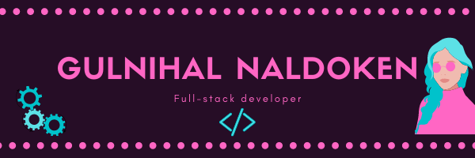

### Hi there 👋 I'm Gulnihal

- 🔭 I’m currently a Full-stack developer at 
- 🌱 I’m currently improving my tech skills
- 👯 I’m looking to collaborate on applications built based on React and PostgreSQL, and to learn new frameworks
- 📫 How to reach me:    <a href="www.linkedin.com/in/gulnihalnaldoken"> /gulnihalnaldoken 

 
 | 